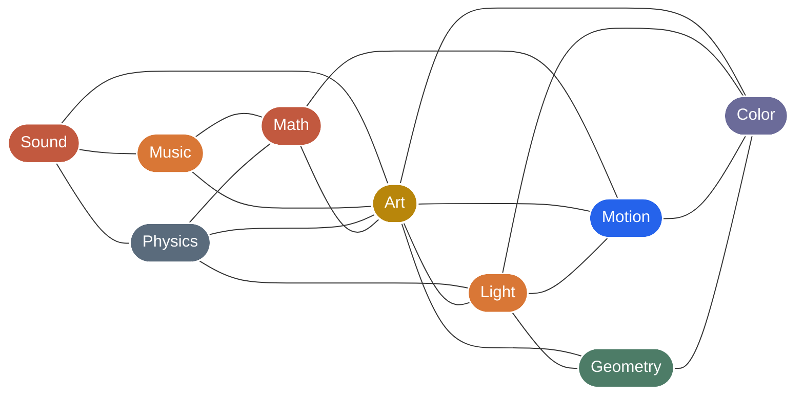
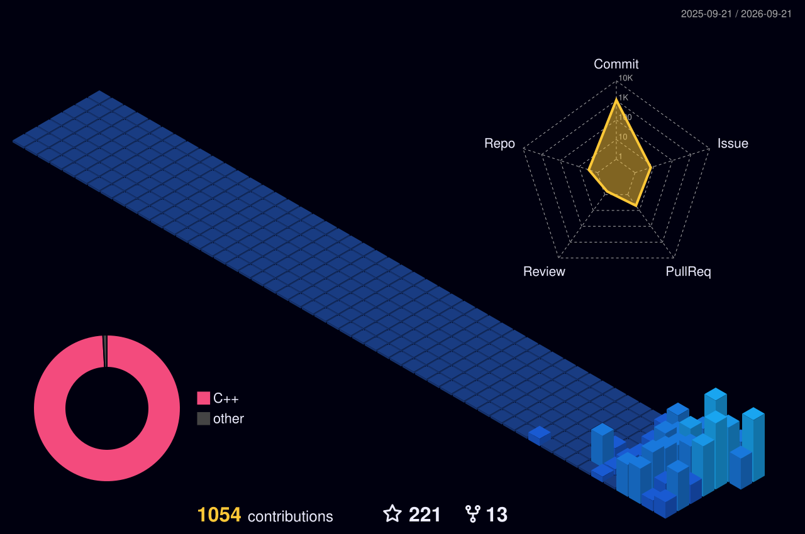

  

  <h1>hi, i'm naman (n1m21n)</h1>

  

    <strong>musician • visual artist • creative technologist</strong>
  

  

    <em>"crafting open-source instruments where sound, art, and geometry connect."</em>
  

  

    
    
    
  

---

### What I'm Building: [Infinite](https://github.com/n1m21n/Infinite)

> **A unified node-based audiovisual modular workstation for macOS and Windows.**  
> Real-time GPU video shaders, procedural 3D geometry and simulations, and a full modular synthesizer rack with AU/VST3 plugin hosting — interconnected through a universal modulation graph.

  

---

### Connected by Nature

---

### Contribution Activity

  <picture>
    <source media="(prefers-color-scheme: dark)" srcset="profile-3d-contrib/profile-night-view.svg">
    <source media="(prefers-color-scheme: light)" srcset="profile-3d-contrib/profile-season.svg">
    
  </picture>

---

### Connect

- Discord Community: [Join the Infinite Server](https://discord.gg/wpKdexvhn)
- Twitter / X: [@n1m21n](https://x.com/n1m21n)
- Instagram: [@n1m21n](https://instagram.com/n1m21n)
- Email: namansoniiii21@gmail.com

  Designed with curiosity and passion for generative sound and computational art.

